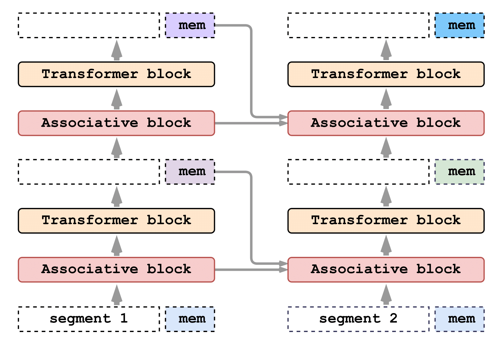

# Associative Recurrent Memory Transformer implementation compatible with Hugging Face models


ARMT is a memory-augmented segment-level recurrent Transformerm based on Recurrent Memory Transformer. It enhances the original RMT with capacious and flexible associative memory and achieves state-of-the-art scores on BABILong benchmark.

> [paper](https://arxiv.org/abs/2407.04841), [code](https://github.com/RodkinIvan/associative-recurrent-memory-transformer) Associative Recurrent Memory Transformer


Associative Recurrent Memory Transformer is implemented as follows:



We implement our memory mechanism with no changes to Transformer model by adding special memory tokens to the input sequence. The model is trained to control both memory operations and sequence representations processing.

## Installation
```bash
pip install -e .
```
This command will install `lm_experiments_tools` with only required packages for Trainer and tools.

`lm_experiments_tools` Trainer supports gradient accumulation, logging to tensorboard, saving the best models
based on metrics, custom metrics and data transformations support.

### Install requirements for all experiments
Full requirements for all experiments are specified in requirements.txt. Install requirements after cloning the repo:
```bash
pip install -r requirements.txt
```


## Citation
If you find our work useful, please cite the RMT and ARMT papers:
```
@inproceedings{
        bulatov2022recurrent,
        title={Recurrent Memory Transformer},
        author={Aydar Bulatov and Yuri Kuratov and Mikhail Burtsev},
        booktitle={Advances in Neural Information Processing Systems},
        editor={Alice H. Oh and Alekh Agarwal and Danielle Belgrave and Kyunghyun Cho},
        year={2022},
        url={https://openreview.net/forum?id=Uynr3iPhksa}
}
```
```
@misc{bulatov2023scaling,
      title={Scaling Transformer to 1M tokens and beyond with RMT}, 
      author={Aydar Bulatov and Yuri Kuratov and Mikhail S. Burtsev},
      year={2023},
      eprint={2304.11062},
      archivePrefix={arXiv},
      primaryClass={cs.CL}
}
```
```
@misc{rodkin2024associativerecurrentmemorytransformer,
      title={Associative Recurrent Memory Transformer}, 
      author={Ivan Rodkin and Yuri Kuratov and Aydar Bulatov and Mikhail Burtsev},
      year={2024},
      eprint={2407.04841},
      archivePrefix={arXiv},
      primaryClass={cs.CL},
      url={https://arxiv.org/abs/2407.04841}, 
}
```